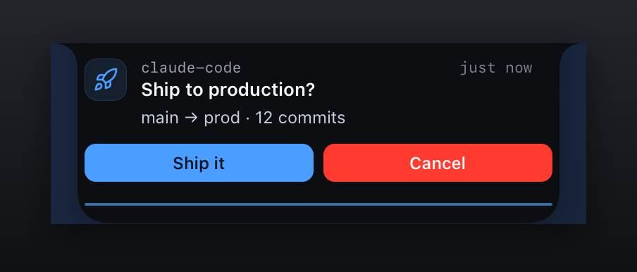
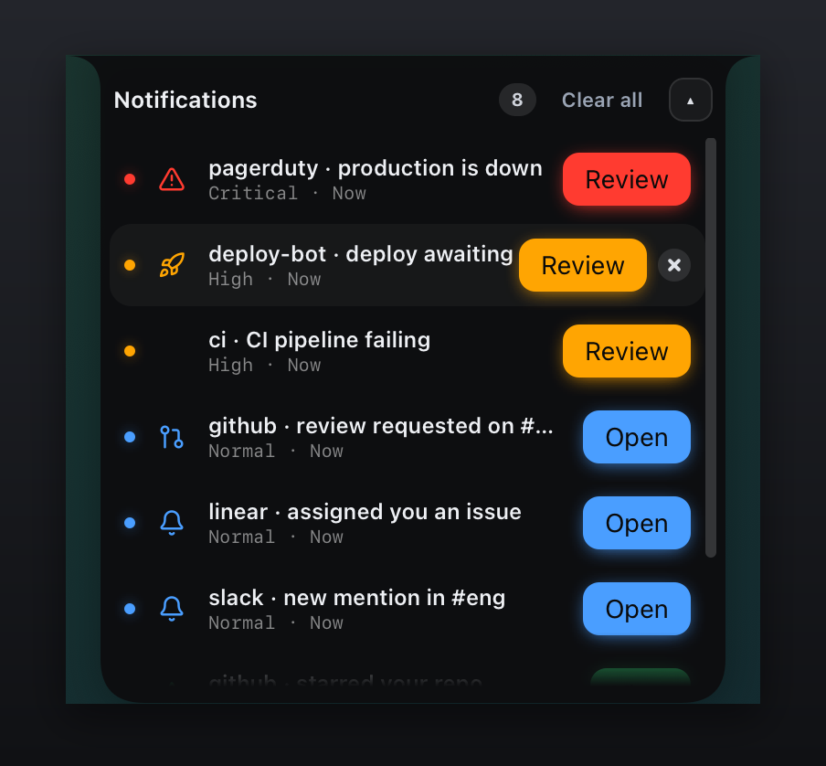

# Dynamic Island reference

The Dynamic Island is syncfu's second notification presentation: a pure-black
capsule anchored top-center that spring-morphs between a compact pill and an
expanded card. It is additive. The top-right glass card stays the default, and a
sender opts into the island per notification with `--presentation island`. On a
MacBook the capsule hugs the physical notch; on non-notch Macs, Windows, and
Linux it renders as a floating capsule.

This document is the consolidated reference: the interaction model, all 13
settings, the payload field, the capture matrix, dismissal, single-instance
behavior, and troubleshooting. Runnable scripts live in `examples/`.

<table>
<tr>
<td align="center"><br /><sub>Idle — compact ambient pill</sub></td>
<td align="center"><br /><sub>Expanded — a decision that blocks on <code>--wait</code></sub></td>
</tr>
<tr>
<td align="center"><br /><sub>Live progress — mini-ring while collapsed</sub></td>
<td align="center"><br /><sub>Multiple — spotlight + ranked list</sub></td>
</tr>
</table>

## When to use the island vs the card

- Reach for the **island** for glanceable, ambient status on long-running work
  (timers, progress, an approval that can sit and wait), and when you want a
  presentation that can be hidden from screen capture.
- Reach for the **card** (the default) for a one-shot message that should land in
  the corner and auto-dismiss on its own.

## Interaction model: four states

In notch mode the island moves through four states. The count is the number of
active island notifications.

```
   count 0            count >= 1, idle          hover the notch/wings        click the pill
  +--------+         +-------------------+       +--------------------+      +-----------------+
  | hidden |  --->   |   ambient wings   | --->  | revealed pill      | ---> | expanded card   |
  | window |         | slim black stubs  |       | slides down under  |      | full content,   |
  | hidden | <---    | beside the cutout |<----  | the cutout with the|<---- | actions, x, bar |
  +--------+  count  | + accent dot or   | leave | collapsed content  | click| (click surface  |
              back 0 | mini progress ring|  +grace                     | card |  to collapse)   |
                     +-------------------+       +--------------------+      +-----------------+
```

1. **Hidden** (count 0): the island window is hidden entirely. Zero idle cost -
   the cursor tracker only polls while a notification exists.
2. **Ambient wings** (collapsed, idle): the under-notch pill is concealed and a
   minimal indicator takes its place - two slim black extensions ("wings") that
   peek out beside the physical cutout, flush at the screen top, so the notch
   looks a touch wider. The right wing carries a small priority-accent dot, or a
   mini progress ring when the notification carries progress. The wings ARE the
   ambient signal; there is no glyph or label (it cannot seat legibly in that
   band).
3. **Revealed pill** (hover): hovering the physical notch or its ambient wings
   slides a second notch-shaped pill down beneath the cutout with the collapsed
   content. Moving the cursor away conceals it back to the wings after a short
   grace (400ms), so a brief overshoot on the way to the pill does not flicker it.
4. **Expanded card** (click / arrival): the full card with icon, title, body,
   progress, action buttons, and a hover-visible dismiss x. Click the revealed
   pill to expand; click the card surface (anywhere that is not a button) to
   collapse back.

**Arrival**: a fresh notification announces itself EXPANDED, holds for about
2.6s, then animates back down to the collapsed live pill. Two exceptions stay
expanded and never auto-collapse: a **decision** (a notification carrying action
buttons, the frontend proxy for a pending `--wait`) and any **critical**
notification.

**Interactivity**: the whole island window is a transparent, click-through
envelope. Clicks pass through to the apps underneath EXCEPT over the drawn shape
itself - the backend tracks the cursor against the reported shape hitbox and
flips the window interactive only while the pointer is over the pill or card.

Float / non-notch mode has no ambient-wings or hover-reveal step: the pill is
always visible, and it expands on click and auto-collapses on the same lifecycle.

## Dismissal

There are three ways to dismiss, all resolving the same waiter path a dismissed
card uses (CLI `--wait` exit 1):

- **Expanded card x**: hover the expanded card to reveal a close x in its corner.
  This is also THE way to dismiss a **critical no-action** notification, which
  never auto-dismisses and carries no action buttons - without this x it would be
  undismissable from the island UI.
- **Per-row x** (multi-notification list): each row in the expanded list has its
  own hover-visible x that dismisses just that row and resolves only that row's
  waiter, never crossing notifications.
- **"Clear all"** (multi-notification list header): empties the island in one
  click. It calls the backend `dismiss_all`, which clears the manager atomically
  and resolves every waiter as dismissed. **Side effect (user-facing):** this
  also clears any top-right CARD notifications, not just the island. It is a
  deliberate global clear, chosen over a per-row loop because a loop would leave
  merged duplicates behind (dedupe re-promotes the next-ranked duplicate).

## Multiple notifications (Model B)

When more than one island notification is active, the compact pill shows the
highest-priority **spotlight** item plus an `xN` count badge (capped at `9+`).
Click the spotlight to expand a priority-ranked, deduped list (critical first),
capped at 6 rows before it scrolls. Auto-dismiss is paused while the list is
open. Notifications with a pending `--wait` are exempt from de-duplication so
each keeps its own exit code. The grouped view stays notch-hugging; it does not
degrade to a plain rounded card.

## Sending to the island

Route any notification to the island with `--presentation island` (the default
is `card`):

```bash
syncfu send --presentation island -t "Deploying" "Rolling out v2.3"
```

Everything the card supports works on the island: actions, priority timeouts,
progress, grouping, and all 27 style overrides. Geometry and position are app
settings (below), NOT payload fields; the payload's only styling channel is the
`style` overrides.

Over HTTP the field is `presentation` on the notify payload:

```bash
curl -X POST localhost:9868/notify \
  -H "Content-Type: application/json" \
  -d '{"sender":"deploy","title":"Deploying","body":"Rolling out v2.3","presentation":"island"}'
```

An omitted `presentation` defaults to the card, so existing integrations are
unchanged. A present value must be `card` or `island`.

## `--wait` on the island: the exit-code contract

A `--wait` decision blocks the CLI until the human resolves it, then exits:

| Outcome | stdout | Exit code |
|---------|--------|-----------|
| Action button clicked | the action id | 0 |
| Dismissed (card x, per-row x, or "Clear all") | `dismissed` | 1 |
| Unanswered until `--wait-timeout` elapses | `timeout` | 2 |

On the island a decision arrives expanded and STAYS expanded until answered; its
auto-dismiss is paused. So the only "unanswered" outcome is the CLI's
`--wait-timeout` (default 300s) elapsing, which exits `2`. This differs from the
top-right card, where an unanswered non-critical decision auto-dismisses when its
priority timeout elapses and the command exits `1`. An agent gating work on a
human decision should branch on all three codes (see
`examples/agent-approval-gate.sh`).

## Notch vs float

- **Notch mode** (default): the capsule hugs the top-center notch. The compact
  pill is sized and positioned from the real measured cutout - its width matches
  the physical cutout so it reads as an extension of the notch, and the whole
  island is offset down by the cutout height so content sits below the cutout,
  never behind it. The pill stays pure black even in light appearance so it
  blends with the physical notch. `position` is ignored in notch mode.
- **Float mode**: a fully-rounded floating capsule placed `left`, `center`,
  `right`, or `bottom-center` (`bottom-center` is float-only and expands upward).
  Non-notch Macs, Windows, and Linux always float. Float layout is unchanged from
  before the notch adaptation.

## Display targeting (multi-monitor)

The island follows the ACTIVE screen: on every show it targets the monitor under
your cursor, exactly like the top-right card. The layout adapts per display:

| Your `mode` setting | Cursor on the notched built-in | Cursor on a non-notch display |
|---|---|---|
| `notch` (default, auto) | under-notch model (wings, hover-reveal) | floating capsule, top-center |
| `float` (explicit override) | floating capsule everywhere | floating capsule at your `position` |

`position` (left / center / right / bottom-center) applies only with `mode: float`;
the automatic notch-to-float fallback always anchors top-center.

## Island window events (backend to webview)

| Event | Payload | Purpose |
|---|---|---|
| `island:snapshot` | ranked Model B snapshot | the ONLY render data source (Rust-owned) |
| `island:settings` | the 13 settings | live restyle without resend |
| `island:geometry` | cutout `{widthLogical, heightLogical}` or `null` | notch vs float layout per current display |
| `island:reveal` | boolean | hover-reveal state for the collapsed pill |
| `island:hover` | boolean | cursor over the shape; pauses auto-dismiss like the card |

## Settings (13, app-wide)

The island's geometry and appearance are **app-wide settings**, not
per-notification. Senders never control them. Configure them from the app's
Island panel for live changes; they persist across restarts as
`island.settings.json` in the app config dir (on macOS,
`~/Library/Application Support/dev.syncfu.app/island.settings.json`). The on-disk
shape wraps the keys in an `{ "island": { ... } }` envelope. Out-of-range numeric
values are clamped on load, not rejected; a missing or corrupt file falls back to
the defaults.

| Setting | Range | Default | Notes |
|---------|-------|---------|-------|
| `compactWidth` | 150-600 | 218 | compact pill width (px); in notch mode the live cutout width wins |
| `expandedWidth` | 320-560 | 380 | expanded card width (px) |
| `height` | 24-60 | 34 | capsule height (px); in notch mode at least the cutout height |
| `surfaceOpacity` | 0-100% | 94 | surface fill alpha, stored as 0.0-1.0 (0.94) |
| `topRadius` | 0-24 | 6 | top-corner radius (px) |
| `bottomRadius` | 0-40 | 14 | bottom-corner radius (px) |
| `cornerScaling` | on / off | on | scale radii between compact and expanded |
| `accent` | preset or hex | `#4a9eff` | accent color |
| `mode` | notch / float | notch | notch hugs the notch; float detaches |
| `position` | left / center / right / bottom-center | center | float mode only |
| `appearance` | dark / light / auto | dark | the notch compact pill stays black even in light |
| `reducedMotion` | on / off | off | uses the calmer 1000/100 springs (near-instant morph) |
| `hideFromScreenCapture` | on / off | on | exclude from screen capture (see matrix) |

Only size and placement fields (`compactWidth`, `expandedWidth`, `height`,
`topRadius`, `bottomRadius`, `cornerScaling`, `mode`, `position`) reflow the
window when changed. Accent, opacity, appearance, reduced-motion, and capture are
restyled in place with no reflow.

## Screen-capture support matrix

`hideFromScreenCapture` maps to the OS content-protection flag. What the OS
actually delivers, and what the app reports:

| Platform | Behavior | Notes |
|----------|----------|-------|
| macOS 14 (Sonoma) and earlier | Hidden | Guaranteed: the OS honors the exclusion. |
| macOS 15 (Sequoia) and later | Best effort | The flag is applied but ScreenCaptureKit can still capture the window, and there is no public API to force exclusion. The app reports this honestly and never claims a guarantee. |
| Windows 10 build 19041 and newer | Hidden | Guaranteed (`WDA_EXCLUDEFROMCAPTURE`). |
| Windows older than build 19041 | Not supported | No reliable exclusion mechanism. |
| Linux | Not supported | No reliable capture-exclusion API. |

The island never claims to be invisible where the OS cannot deliver it. On macOS
15+ and unsupported platforms the setting is surfaced with its true status
(reported as `best-effort`, `unsupported`, or `unknown`).

## Single-instance behavior

Only one syncfu app runs at a time. A second launch is terminated immediately and
the FIRST instance's main window comes to the front (shown, focused, unminimized
if it was minimized). This prevents a duplicate instance from squatting beside
the first with a dead HTTP bind on `:9868`. If you see a
`FATAL: HTTP server on :9868 failed to bind` line even though no second syncfu is
running, some OTHER process holds the port - free it with
`lsof -iTCP:9868 -sTCP:LISTEN`.

## Troubleshooting

- **Nothing appears when I send to the island.** The desktop app must be running
  (system tray). Confirm with `syncfu health` (or `curl localhost:9868/health`).
  A stale CLI is a common cause: `--presentation island` was added in the island
  release, so an older `syncfu` binary rejects the flag with
  `unexpected argument '--presentation'`. Reinstall the CLI, or send over HTTP
  with `"presentation":"island"` in the payload.
- **The pill is invisible until I hover.** That is the ambient-wings state working
  as designed on the notch: while collapsed and idle you see only the wings and
  the accent dot/ring beside the cutout. Hover the notch to reveal the pill, or
  click it to expand.
- **The dev app shows in the dock/menu bar as "exec".** Under `pnpm tauri dev` on
  macOS the running process can surface a generic `exec` name in the dock and
  menu bar instead of `syncfu`. It is cosmetic and dev-only; a real
  `pnpm tauri build` bundle uses the configured product name `syncfu`.
- **The debug binary launches with a blank window.** In the dev configuration the
  app loads its UI from `devUrl` (`http://localhost:1420`), which only the Vite
  dev server serves. Running the bare `target/debug/syncfu` binary on its own has
  nothing serving `:1420`, so the window comes up blank. Run `pnpm tauri dev`
  (which starts Vite and the app together), or do a full `pnpm tauri build` to get
  a standalone binary that bundles the frontend from `frontendDist` (`../dist`).

## Examples

Runnable scripts in `examples/` (each has a header comment and was exercised
against a live app):

- `agent-approval-gate.sh` - send a decision with `--wait`, branch on exit code.
- `long-task-progress.sh` - create one notification, then update its progress in
  a loop.
- `multi-notification-model-b.sh` - fill the island to demonstrate the
  spotlight + list, per-row x, and "Clear all".
- `island-settings.sh` - write `island.settings.json` (with the restart note).
